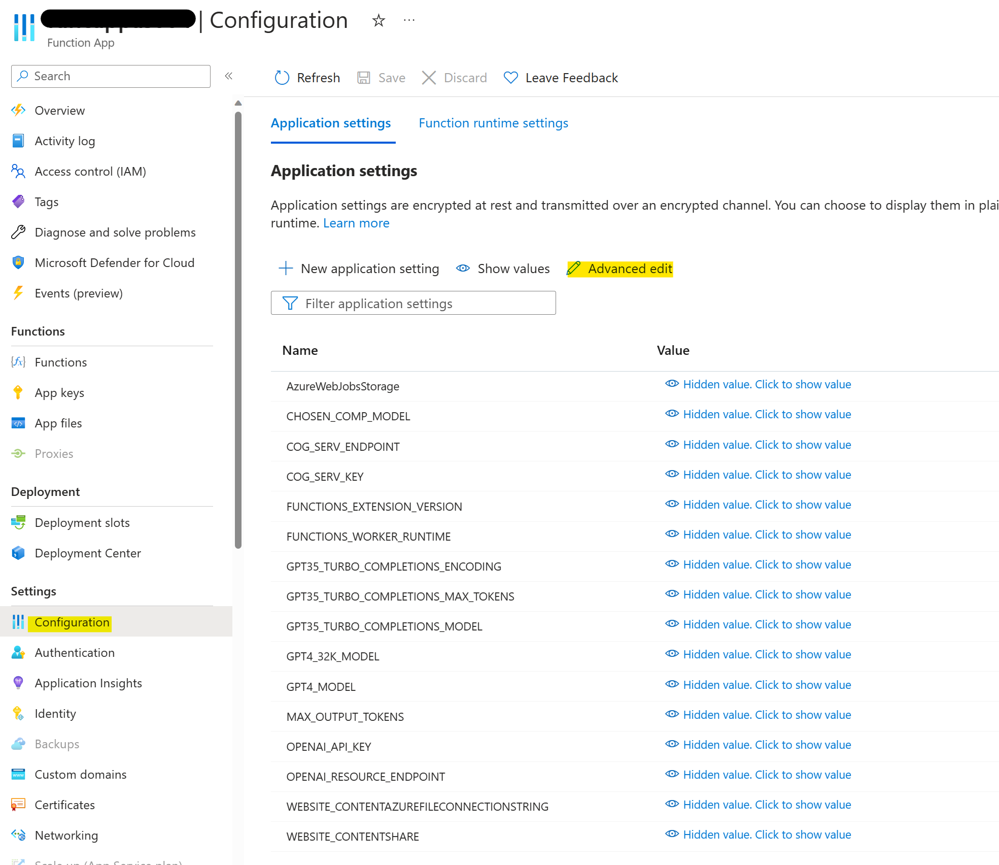

> **Note:**
> IMPORTANT - Regardless of the function app timeout setting, 230 seconds is the maximum amount of time that an HTTP triggered function can take to respond to a request. You can read more about this [here](https://learn.microsoft.com/en-us/azure/azure-functions/functions-scale#timeout)
> This means that the documents for summarization should not timeout after 230 seconds.
> To allow for longer documents, please adapt the code to use asynchonous features.

# Document Summarization Using Azure OpenAI
Document summarization is a vital tool in the field of Natural Language Processing (NLP) and information retrieval, aimed at extracting the most important information from a document or a set of documents. In this guide, we will walk through the concept of document summarization, why chunking might be necessary, and how to utilize Azure OpenAI's GPT models for this task. We'll cover two main approaches: map-reduce and refine.

## Chunking
A long document consists of multiple ideas, points, arguments, or facts. Directly summarizing a long document as a whole can result in loss of crucial context or details. To avoid this, we chunk a document into smaller parts, allowing us to maintain the document's informational hierarchy and make the summarization process more manageable and efficient.

Chunking can also help to deal with the maximum token limit constraint in models like Davinci-003, ChatGPT or GPT-4, where the total number of input tokens (including the document and any instructions) can't exceed the model's specified limit.

## Summarization Approaches
### 1. Map-Reduce
The Map-Reduce approach is a computational model that can efficiently process and generate summaries of large data sets. In the context of document summarization:

**Map:** This step involves chunking the document into smaller pieces and summarizing each piece individually.

**Reduce:** Here, all the individual summaries are combined to form the final summary.

This approach allows distributed processing of large documents, but one of the challenges here is to ensure the final summary maintains a coherent flow of information.

### 2. Refine
The refine approach is a two-step process:

**Initial Summary:** Create an initial summary of the document using any chosen summarization technique.

**Refinement:** Use additional computational models to further refine and condense the initial summary.

This method is useful when there's a need to create a highly condensed summary while retaining the most crucial information.

## Benefits of Using GPT Models for Summarization
- **Quality**: GPT model's understanding of natural language is sophisticated, resulting in high-quality summaries that retain key points and context.

- **Flexibility**: You can instruct GPT models to generate summaries of varying lengths according to your needs.

- **Language Support**: GPT models can generate summaries in multiple languages, making it versatile for global use cases.

- **Scalability**: With proper chunking and techniques like map-reduce or refine, GPT models can handle large documents effectively.

## Deployment Guide

This deployment guide guides you through the process of creating and deploying an Azure Function, which can be used for summarization.

### Prerequisites

Ensure you have the following installed or set up:

1. [Visual Studio Code](https://code.visualstudio.com/download): An open-source code editor developed by Microsoft.
2. [Azure Functions Extension for VS Code](https://marketplace.visualstudio.com/items?itemName=ms-azuretools.vscode-azurefunctions): This extension aids in creating, testing, and deploying Azure Functions from VS Code.
3. [Azure Functions Core Tools](https://www.npmjs.com/package/azure-functions-core-tools): It provides a local development experience for creating, developing, testing, running, and debugging Azure Functions.
4. [Node.js](https://nodejs.org/en/download/): A JavaScript runtime needed to run the Azure Functions Core Tools.
5. [Azure Account](https://portal.azure.com/): You'll need an Azure subscription to deploy your function app to Azure. If you don't have one, you can create a free account.

### Please Note : 

1. Regardless of the function app timeout setting, 230 seconds is the maximum amount of time that an HTTP triggered function can take to respond to a request. You can read more about this [here](https://learn.microsoft.com/en-us/azure/azure-functions/functions-scale#timeout)
2. If you're looking to only do summarization and not use form-recognizer, remember to uncomment lines 36-52 in init.py and comment lines 18-34. Additionally, change the request body to :

```{json}
{
    "file_text": "",
    "mode": "refine"
}
```

## Steps to Create and Deploy the Azure Function

### Step 1: Clone the GitHub Repository

1. Clone the GitHub repository on your local machine/VM
2. Open the folder from VS code
3. Sign into Azure account from VS code

### Step 2: Create a function app

1. Follow the steps [here](https://learn.microsoft.com/en-us/azure/azure-functions/functions-create-function-app-portal#create-a-function-app) to create a function app with a consumption plan. The key details when deploying (deploy code, Python runtime stack, 3.10 version, Linux OS) -
<br/>
<br />
<p align="center">
 
</p>
<br/>

2. After successful deployment of the function app, go to the Function App Settings > Configuration > Advanced edit. Add the remaining application settings (you can add them manually or by **appending** the following json when advanced editing)

<br/>
<br/>
<p align="center">
 
</p>
<br/>

**DO NOT CHANGE ANY EXISTING SETTING OR VALUE, ADD THE BELOW TO THE CONFIGURATION**
<br/> 
Populate -
<br/>
* COG_SERV_ENDPOINT : Cognitive service / Form Recognizer Endpoint
* COG_SERV_KEY : Cognitive service / Form Recognizer Key
* OPENAI_RESOURCE_ENDPOINT : OpenAI Resource Endpoint
* OPENAI_API_KEY : OpenAI Resource Key

<br/>

```json
  {
    "name": "CHOSEN_COMP_MODEL",
    "value": "gpt-35-turbo",
    "slotSetting": false
  },
  {
    "name": "COG_SERV_ENDPOINT",
    "value": "",
    "slotSetting": false
  },
  {
    "name": "COG_SERV_KEY",
    "value": "",
    "slotSetting": false
  },
  {
    "name": "GPT35_TURBO_COMPLETIONS_ENCODING",
    "value": "cl100k_base",
    "slotSetting": false
  },
  {
    "name": "GPT35_TURBO_COMPLETIONS_MAX_TOKENS",
    "value": "8193",
    "slotSetting": false
  },
  {
    "name": "GPT35_TURBO_COMPLETIONS_MODEL",
    "value": "gpt-35-turbo",
    "slotSetting": false
  },
  {
    "name": "GPT4_32K_MODEL",
    "value": "gpt-4-32k",
    "slotSetting": false
  },
  {
    "name": "GPT4_MODEL",
    "value": "gpt-4",
    "slotSetting": false
  },
  {
    "name": "MAX_OUTPUT_TOKENS",
    "value": "500",
    "slotSetting": false
  },
  {
    "name": "OPENAI_API_KEY",
    "value": "",
    "slotSetting": false
  },
  {
    "name": "OPENAI_RESOURCE_ENDPOINT",
    "value": "",
    "slotSetting": false
  }
```
3. Save the new configuration settings and restart the function app.

### Step 3: Deploy the Function to Azure through VS Code

1. Click on the Azure icon in the Activity Bar.
2. In the Azure: Resources area, click on the selected Subscription > Function App > Function.
3. Right click and select "Deploy to Function App".

<br/>
<br/>
<p align="center">
 
</p>
<br/>

4. VS Code will start the deployment process. Once the deployment is complete, a notification will appear.
5. Click on the 'Go to resource' button in the notification to view your deployed function in the Azure portal.

### Step 4: Test your API with Postman

1. On the function page, select Overview from the left menu.
2. Select Get function URL from the top menu and copy the URL.

<br/>
<p align="center">
 
</p>

3. Create a Postman request as below with the API/Function URL:

<br/>
<p align="center">
 
</p>

```{json}
{
    "file_url": "",
    "mode": "refine"
}
```

4. Get the summarized output back!

<br/>
<p align="center">
 
</p>


### Thank You Note
This repository leverages the summarization code/logic from [this repository](https://github.com/samelhousseini/km-openai/tree/main). 
